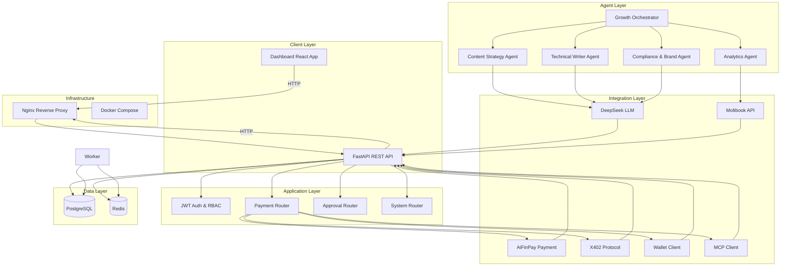

# AIFP-AOS Architecture

## System Architecture

## Component Overview

### Client Layer
- **Dashboard**: React-based admin interface for content management and approval workflows
- **API**: FastAPI REST API with JWT authentication and RBAC

### Application Layer
- **APIAuth**: JWT token generation and verification, role-based access control
- **Payments**: Payment creation, approval, and execution with safety controls
- **Approvals**: Content approval queue and workflow management
- **System**: Health checks, configuration, and system status endpoints

### Agent Layer
- **Content Strategy Agent**: Generates content strategy and content calendar
- **Technical Writer Agent**: Creates technical documentation and blog posts
- **Compliance & Brand Agent**: Ensures content meets brand guidelines and compliance requirements
- **Analytics Agent**: Tracks content performance and provides insights
- **Growth Orchestrator**: Coordinates agents and manages content growth campaigns

### Integration Layer
- **DeepSeek LLM**: AI-powered content generation
- **Moltbook API**: Content publishing and analytics platform
- **AiFinPay Payment**: Payment processing and safety controls
- **X402 Protocol**: Cross-chain payment protocol
- **Wallet Client**: Blockchain wallet management
- **MCP Client**: Model Context Protocol integration

### Data Layer
- **PostgreSQL**: Primary database for persistent data
- **Redis**: Caching and task queue

### Infrastructure
- **Nginx**: Reverse proxy with SSL termination and rate limiting
- **Docker Compose**: Container orchestration for multi-environment deployment

## Data Flow

### Content Creation Flow
1. Growth Orchestrator identifies growth opportunities
2. Content Strategy Agent generates content strategy
3. Technical Writer Agent creates content based on strategy
4. Compliance & Brand Agent reviews and approves content
5. Content submitted to approval queue
6. Human operator reviews and approves content
7. Content published to Moltbook via API

### Payment Processing Flow
1. Payment request created via API
2. Safety checks applied (kill switch, allowlist, limits)
3. Payment routed to appropriate processor (AiFinPay/X402)
4. Blockchain transaction executed
5. Payment status updated in database
6. Audit event recorded

### Security Flow
1. Client authenticates with credentials
2. JWT token generated with user role
3. Token validated on each request
4. RBAC checks applied based on user role
5. Request processed if authorized

## Deployment Architecture

### Development Environment
- Source code bind-mounts for hot reload
- In-memory SQLite for tests
- PostgreSQL for development data
- No SSL (HTTP only)
- Debug logging enabled

### Staging Environment
- Built Docker images (no bind-mounts)
- PostgreSQL persistent volumes
- Redis persistent volumes
- Self-signed SSL certificates
- Production-like configuration
- Nginx reverse proxy

### Production Environment
- Built Docker images (no bind-mounts)
- PostgreSQL persistent volumes
- Redis persistent volumes
- Let's Encrypt SSL certificates
- Production configuration
- Nginx reverse proxy
- Monitoring and alerting
